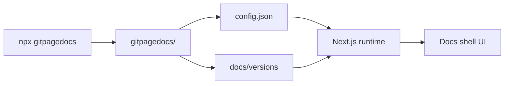

# Vision general del proyecto

Git Page Docs esta impulsado por Next.js 15, React 19, TypeScript y Node.js. Genera documentacion multilingue para GitHub Pages.

## Stack

- Next.js 15
- React 19
- TypeScript
- Node.js 20+

## Objetivo

Construir documentacion multilingue para repositorios GitHub con soporte para versiones, temas y contenido md/html/video.

## Arquitectura (resumen)

### Flujo de datos

1. **CLI** (`npx gitpagedocs`) escanea el proyecto y escribe `gitpagedocs/config.json`, `gitpagedocs/docs/versions/<ver>/*` y opcionalmente `gitpagedocs/layouts/`.
2. **Request** llega a `/owner/repo/v/x.y.z` (o equivalente local).
3. **Runtime** carga config (local o remoto), resuelve version, obtiene markdown y layouts.
4. **Docs shell** renderiza contenido con estado de idioma/version/tema y sincronizacion de URL.

### Carpetas principales

| Path | Rol |
|------|-----|
| `gitpagedocs/config.json` | Config raiz (site, VersionControl, layout) |
| `gitpagedocs/docs/versions/<ver>/config.json` | Rutas y menus por version |
| `gitpagedocs/docs/versions/<ver>/{en,pt,es}/*.md` | Contenido markdown |
| `gitpagedocs/docs/versions/<ver>/{en,pt,es}/source-viewer` | Visor de codigo HTML |
| `gitpagedocs/layouts/` | Layouts locales (con `--layoutconfig`) |
| `src/app/`, `src/entities/`, `src/widgets/` | App Next.js, load-docs, docs-shell |

> Version (ES): 1.0.0
