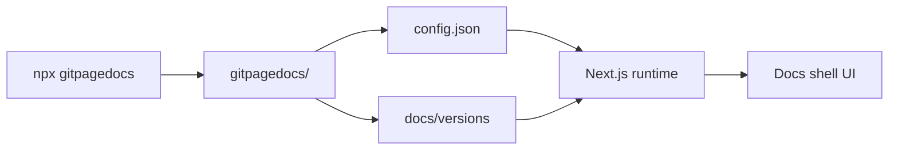

# Visao geral do projeto

Git Page Docs e alimentado por Next.js 15, React 19, TypeScript e Node.js. Gera documentacao multilinguagem para GitHub Pages.

## Stack

- Next.js 15
- React 19
- TypeScript
- Node.js 20+

## Objetivo

Construir documentacao multilinguagem para repositorios GitHub com suporte a versoes, temas e conteudo md/html/video.

## Arquitetura (resumo)

### Fluxo de dados

1. **CLI** (`npx gitpagedocs`) escaneia o projeto e escreve `gitpagedocs/config.json`, `gitpagedocs/docs/versions/<ver>/*` e opcionalmente `gitpagedocs/layouts/`.
2. **Request** chega em `/owner/repo/v/x.y.z` (ou equivalente local).
3. **Runtime** carrega config (local ou remoto), resolve versao, busca markdown e layouts.
4. **Docs shell** renderiza conteudo com estado de idioma/versao/tema e sincronizacao de URL.

### Pastas principais

| Path | Papel |
|------|-------|
| `gitpagedocs/config.json` | Config raiz (site, VersionControl, layout) |
| `gitpagedocs/docs/versions/<ver>/config.json` | Rotas e menus por versao |
| `gitpagedocs/docs/versions/<ver>/{en,pt,es}/*.md` | Conteudo markdown |
| `gitpagedocs/docs/versions/<ver>/{en,pt,es}/source-viewer` | Visualizador de codigo HTML |
| `gitpagedocs/layouts/` | Layouts locais (com `--layoutconfig`) |
| `src/app/`, `src/entities/`, `src/widgets/` | App Next.js, load-docs, docs-shell |

> Versao: 1.1.0
