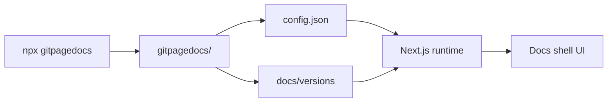

# Project Overview

Git Page Docs is powered by Next.js 15, React 19, TypeScript, and Node.js. It builds multilingual documentation for GitHub Pages.

## Stack

- Next.js 15 with App Router
- React 19
- TypeScript
- Static export for GitHub Pages
- gray-matter, marked for Markdown
- react-icons
- ESLint

## Goals

- Generate and maintain a `gitpagedocs/` folder with config and versioned content
- Support Markdown, HTML (local or URL), and video embeds
- Multilingual: en, pt, es
- Theme system with JSON templates
- Local and GitHub Pages execution

## Architecture (summary)

### Data flow

1. **CLI** (`npx gitpagedocs`) scans the project and writes `gitpagedocs/config.json`, `gitpagedocs/docs/versions/<ver>/*`, and optionally `gitpagedocs/layouts/`.
2. **Request** arrives at `/owner/repo/v/x.y.z` (or local equivalent).
3. **Runtime** loads config (local or from remote repo), resolves version, fetches markdown and layouts.
4. **Docs shell** renders content with language/version/theme state and URL sync.

### Main folders

| Path | Role |
|------|------|
| `gitpagedocs/config.json` | Root config (site, VersionControl, layout source) |
| `gitpagedocs/docs/versions/<ver>/config.json` | Per-version routes, menus |
| `gitpagedocs/docs/versions/<ver>/{en,pt,es}/*.md` | Markdown content |
| `gitpagedocs/docs/versions/<ver>/{en,pt,es}/source-viewer` | Source code viewer HTML |
| `gitpagedocs/layouts/` | Local layouts (with `--layoutconfig`) |
| `src/app/`, `src/entities/`, `src/widgets/` | Next.js app, load-docs, docs-shell |

> Version: 1.1.1
